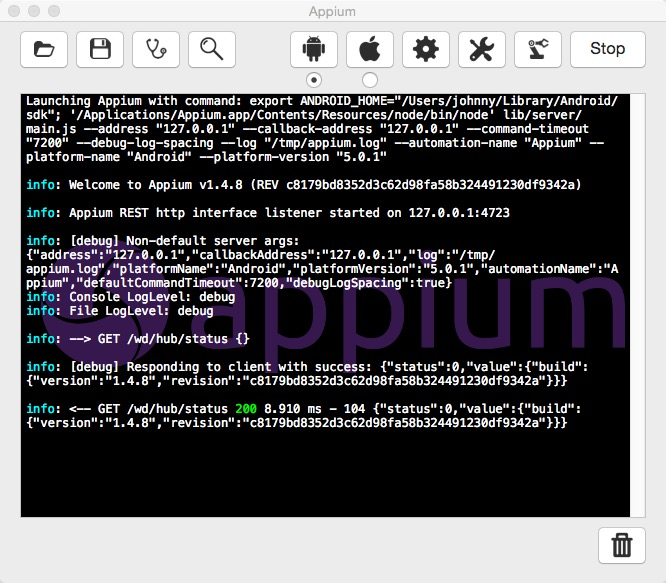
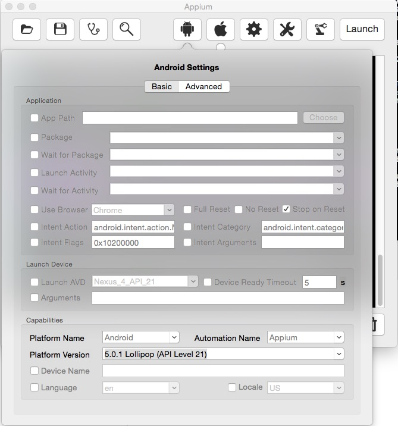
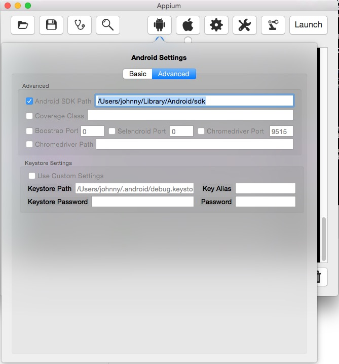
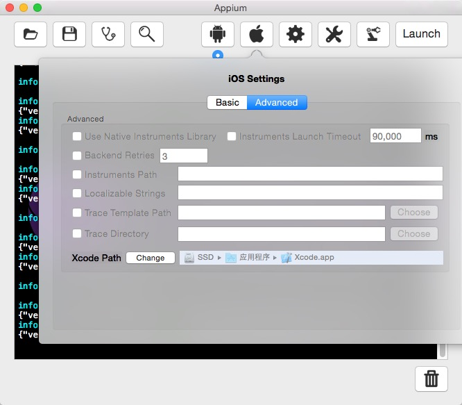

# AppiumTestForAnalysis
===================

###1.打开Appium之后，点击launch，appium会持续保持等待请求的状态

###2.在我们的脚本开始跑之前，先在appium上设置相应的参数（据说这些参数也可以直接在脚本上写进去）
####2.1 Android中设置Platform Name&Platform Version，这些参数直接设置成我们实际应用时会用到的版本

####2.2 iOS中Platform Version也选择我们实际iOS App的版本

