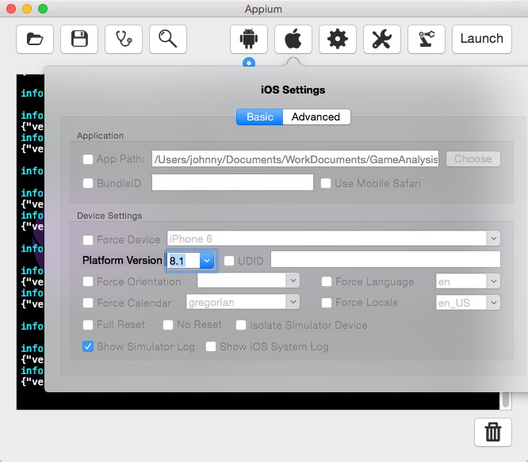

# AppiumTestForAnalysis
===================

###1.打开Appium之后，点击launch，appium会持续保持等待请求的状态

###2.在我们的脚本开始跑之前，先在appium上设置相应的参数（据说这些参数也可以直接在脚本上写进去）
####2.1 Android中设置Platform Name&Platform Version，这些参数直接设置成我们实际应用时会用到的版本

####2.2 iOS中Platform Version也选择我们实际iOS App的版本

###3.针对Android、iOS两个平台，在脚本@Before、@After中设置不同的参数，并且通过定义AppiumDriver<MobileElement>泛型，以及new出来AndroidDriver<MobileElement>&IOSDriver<MobileElement>，通过driver对象就可以进行APP的相应操作
####3.1 Android
    public class AndroidGameTest {

        private AppiumDriver<MobileElement> driver;
        private String sessionId;

        @Before
        public void setup() throws Exception {
            File appDir = new File("/Users/.../.../.../.../build/outputs/apk");
            File app = new File(appDir, "app.apk");
            DesiredCapabilities capabilities = new DesiredCapabilities();
            capabilities.setCapability("deviceName","Android Emulator");
            capabilities.setCapability("platformVersion", "5.0.1 Lollipop");
            capabilities.setCapability("app", app.getAbsolutePath());
            capabilities.setCapability("appPackage", "com.xxxxxxx.xxx.xxxxx");
            capabilities.setCapability("appActivity", ".activities.MainActivity");
            driver = new AndroidDriver<MobileElement>(new URL("http://127.0.0.1:4723/wd/hub"), capabilities);
            driver.manage().timeouts().implicitlyWait(30, TimeUnit.SECONDS);
            sessionId = driver.getSessionId().toString();
        }

        @After
        public void tearDown() throws Exception {
            System.out.println(sessionId);
            Thread.sleep(10);
            driver.quit();
        }
    }
----------------------
####3.2 iOS  
    public class IosGameTest {

    	private AppiumDriver<MobileElement> driver;
    	private String sessionId;

    	@Before
    	public void setup() throws Exception {
        	File appDir = new File("/Users/.../.../.../xcode/GameTest");
        	File app = new File(appDir, "GameTest.app");
        	DesiredCapabilities capabilities = new DesiredCapabilities();
        	capabilities.setCapability(MobileCapabilityType.BROWSER_NAME, "");
        	capabilities.setCapability(MobileCapabilityType.PLATFORM_VERSION, "8.1");
        	capabilities.setCapability(MobileCapabilityType.PLATFORM_NAME, MobilePlatform.IOS);
        	capabilities.setCapability(MobileCapabilityType.DEVICE_NAME, "iPhone 6 (8.1 Simulator) [F26F3E2A-95FC-4C24-9AE0-318616F526BC]");
        	capabilities.setCapability(MobileCapabilityType.APP, app.getAbsolutePath());
        	driver = new IOSDriver<MobileElement>(new URL("http://127.0.0.1:4723/wd/hub"), capabilities);
        	driver.manage().timeouts().implicitlyWait(30, TimeUnit.SECONDS);
        	sessionId = driver.getSessionId().toString();
    	}

    	@After
    	public void tearDown() throws Exception {
        	System.out.println(sessionId);
       		driver.runAppInBackground(10);
        	driver.quit();
    	}
    }
=====================

###4. 针对driver对象进行元素的查找，并对相应element进行操作。
#####Appium支持webdriver定位策略的子集
######1.根据"class"定位(例如， UI组件类型)
######2.根据"xpath"定位 (例如，具有一定约束的路径抽象标示, 基于XPath方式)

###5. 我们可以通过Appium客户端轻松获取到我们想要元素的XPATH
